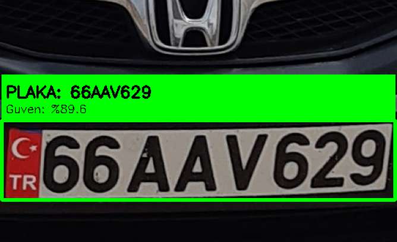

# License Plate Recognition 

This project implements an automated license plate recognition (ALPR) system using deep learning and computer vision techniques. The system is designed to detect, crop, and recognize license plates from images and video streams. It leverages the **YOLO (You Only Look Once)** object detection model, known for its high efficiency and accuracy in real-time applications.

---

## ⚙️ Project Architecture and Structure

The repository is organized to separate data configuration, model core logic, and execution scripts:

* **`data.yaml`**: Configuration file for segmentation data defining the path to the dataset, class names, and image dimensions for training/testing.
* **`model.py`**: Contains the core logic for the deep learning model for detection (e.g., definition, training, or loading weights).
* **`test.py`**: Script used for quantitative evaluation of the model's performance on a test or validation dataset.
* **`video.py`**: Script dedicated to handling live video streaming or processing video files for LPR.
* **`plaka_tanima_oto.yaml`**: Custom configuration file, likely defining specific hyper-parameters or settings for the license plate detection task.
* **`segmentmodel.ipynb`**:  Contains the core logic for the deep learning model for segmentation

---

## 🚀 Setup and Installation

### Prerequisites

* Python 3.8+
* `pip` package manager

### Installation

1.  **Install dependencies**: The project relies on deep learning and computer vision libraries.
    ```bash
    # This command installs the necessary packages, assuming a YOLO framework.
    pip install ultralytics opencv-python torch
    ```

---

## ▶️ Usage

The project provides dedicated scripts for performance evaluation and practical application.

### 1. Testing the Model (test.py)

To evaluate the model's performance (metrics like mAP, Precision, Recall) on a dedicated test dataset, you must execute the **`test.py`** script. You need to specify the source of the test data and the path to your trained model weights.

```bash
# Command to run testing with specified data source and model weights
python test.py --source "path/to/your/test/data/" --weights "path/to/your/model.pt"
```


---



